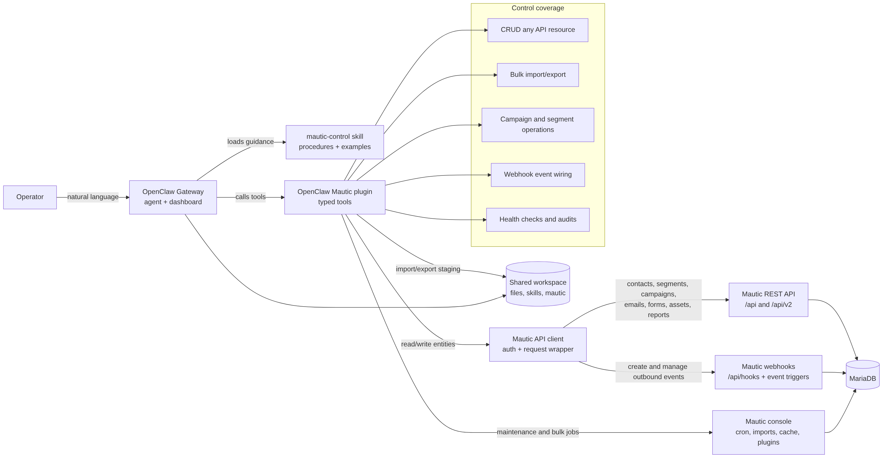

# Mautic Control for OpenClaw

Controlled Mautic CRM operations from OpenClaw: typed API tools, webhook discovery, conservative console maintenance, and guarded workspace staging.



| Package | Runtime | Mautic Target | OpenClaw |
| --- | --- | --- | --- |
| `@completetech/openclaw-mautic-plugin` | `mautic-control` | Mautic 7.x, tested with `7.1.1` | `>=2026.5.22` |

## Install

```bash
openclaw plugins install clawhub:@completetech/openclaw-mautic-plugin
```

After installation, configure the non-secret connection settings in OpenClaw and provide Mautic credentials through environment variables or your platform secret store.

## What You Can Do

| Workflow | Tools | Default Safety |
| --- | --- | --- |
| Check Mautic reachability and policy | `mautic_status` | Read-only status check |
| Work with Mautic API resources | `mautic_request`, `mautic_entity` | Credentials required, API paths only |
| Discover webhook trigger names | `mautic_webhook_triggers` | No credentials required |
| Run maintenance commands | `mautic_console` | Optional bridge, allowlisted commands only |
| Stage import/export files | `mautic_workspace_file` | Off by default, bounded to one workspace root |

## Good Fits

- Inspect Mautic health before generating CRM workflow documents.
- Read or update contacts, companies, segments, campaigns, emails, forms, webhooks, and related API entities through policy-gated calls.
- Confirm available webhook events before designing automations.
- Run narrow Mautic maintenance or automation jobs from a private console bridge when an operator enables them.
- Stage CSV, JSON, or Markdown files in a dedicated workspace directory.

## Conservative by Default

The plugin starts narrow. API access requires credentials, maintenance commands are off, automation jobs are off, and workspace read/write are off until explicitly enabled.

| Capability | Default | Enable Only When |
| --- | --- | --- |
| Mautic API | Available after credentials | The agent is allowed to operate this Mautic instance |
| Console bridge | Status-only | A trusted operator needs allowlisted console commands |
| Automation jobs | Off | Campaign, segment, or webhook jobs are intentional |
| Workspace read/write | Off | A dedicated staging directory is configured |
| Filesystem boundary | Always on | Every path must remain under `allowedWorkspaceRoot` |

## Production Setup

| Step | Setting | Guidance |
| --- | --- | --- |
| Connect Mautic | `baseUrl` | Use the internal URL OpenClaw should call. Use HTTPS for hosted or routed deployments. |
| Add API credentials | `MAUTIC_API_USERNAME`, `MAUTIC_API_PASSWORD` | Store secrets outside plugin UI and source control. |
| Choose API routing | `defaultApiVersion` | Use `legacy` for `/api` or `v2` for `/api/v2` where available. |
| Keep console private | `consoleUrl`, `MAUTIC_CONSOLE_TOKEN` | Deploy the bridge only on a private network and only if console commands are needed. |
| Guard file staging | `workspaceRoot`, `allowedWorkspaceRoot` | Use a dedicated staging directory, not a home directory or secrets path. |
| Limit agent exposure | OpenClaw profiles | Prefer explicit tool allowlists for agents that process untrusted input. |

## Secure Transport

Authenticated tools send Mautic API credentials with each request. Use `https://` for production, hosted, routed, or cross-host deployments.

Plain `http://` is acceptable only for a trusted loopback address or private container network such as `http://mautic_web`. The plugin reports a transport warning for non-HTTPS `baseUrl` values, and authenticated API tools refuse to send credentials to routable plain-HTTP hosts.

## Tools

| Tool | What It Does | Requires |
| --- | --- | --- |
| `mautic_status` | Checks dashboard reachability, API auth, resolved config, transport policy, command policy, and workspace policy. | API credentials for auth check |
| `mautic_request` | Sends authenticated requests to Mautic paths under `/api` or `/api/v2`. | API credentials |
| `mautic_entity` | Lists, reads, creates, updates, and deletes supported Mautic resources. | API credentials |
| `mautic_webhook_triggers` | Lists valid Mautic webhook trigger events. | Plugin only |
| `mautic_console` | Runs allowlisted Mautic console commands through the private bridge. | Console bridge and token |
| `mautic_workspace_file` | Lists, reads, writes, or deletes files under a guarded workspace root. | Workspace toggles |

## Required Secrets

Never store these values in the plugin UI, README, or source control.

| Secret | Purpose |
| --- | --- |
| `MAUTIC_API_USERNAME` | Mautic API username. Use least-privilege credentials. |
| `MAUTIC_API_PASSWORD` | Mautic API password. |
| `MAUTIC_CONSOLE_TOKEN` | Shared token for the optional console bridge. Required only for `mautic_console`. |

OAuth2 is preferred for external production integrations where available. The local verification stack uses Basic auth only for loopback automation.

## Plugin Settings

These settings are non-secret and can be configured in OpenClaw.

| Setting | Default | Production Guidance |
| --- | --- | --- |
| `baseUrl` | `http://mautic_web` | Internal Mautic URL reachable by OpenClaw. |
| `consoleUrl` | `http://mautic_console:8099/console` | Internal bridge URL. Leave unused if console commands are not needed. |
| `workspaceRoot` | `/workspace/mautic` | Dedicated staging directory for file operations. |
| `allowedWorkspaceRoot` | `/workspace/mautic` | Hard boundary for file access. Do not use a home directory or secrets path. |
| `defaultApiVersion` | `legacy` | Use `legacy` or `v2` based on your Mautic routes. |
| `requestTimeoutSeconds` | `60` | HTTP timeout. Range: 5 to 600 seconds. |
| `allowMaintenanceCommands` | `false` | Enables cache/plugin maintenance commands. |
| `allowAutomationJobCommands` | `false` | Enables campaign, segment, and webhook job commands. |
| `allowWorkspaceRead` | `false` | Enables list/read under `workspaceRoot`. |
| `allowWorkspaceWrite` | `false` | Enables write/delete under `workspaceRoot`. |

Environment fallbacks are supported for non-secret settings:

```text
MAUTIC_BASE_URL
MAUTIC_CONSOLE_URL
MAUTIC_WORKSPACE_DIR
MAUTIC_ALLOWED_WORKSPACE_ROOT
MAUTIC_DEFAULT_API_VERSION
MAUTIC_REQUEST_TIMEOUT_SECONDS
MAUTIC_ALLOW_MAINTENANCE_COMMANDS
MAUTIC_ALLOW_AUTOMATION_JOB_COMMANDS
MAUTIC_ALLOW_WORKSPACE_READ
MAUTIC_ALLOW_WORKSPACE_WRITE
```

## Console Bridge

The console bridge is optional. It is needed only for `mautic_console`; API, entity, webhook, status, and workspace tools can run without it.

| Requirement | Production Guidance |
| --- | --- |
| Bridge file | Deploy `mautic/console-bridge.php` only when console commands are required. |
| Network | Keep the bridge on a private network reachable by OpenClaw. |
| Authentication | Protect every request with `MAUTIC_CONSOLE_TOKEN`. |
| Public access | Do not expose the bridge directly to the public internet. |
| Command scope | Keep execution limited to the plugin and bridge allowlists. |

## Local Docker Stack

The companion Docker stack uses explicit local settings:

```text
baseUrl=http://mautic_web
consoleUrl=http://mautic_console:8099/console
workspaceRoot=/workspace/mautic
allowedWorkspaceRoot=/workspace/mautic
defaultApiVersion=legacy
requestTimeoutSeconds=60
allowMaintenanceCommands=true
allowAutomationJobCommands=false
allowWorkspaceRead=true
allowWorkspaceWrite=true
```

These are local-stack defaults, not production defaults. Do not expose the local stack's loopback credentials or Basic auth settings publicly.

## Compatibility

This release was verified against Mautic Community `7.1.1`, the latest GitHub release checked on 2026-05-26. Mautic's own release page lists Mautic 7 as the actively supported series.

| Component | Supported Target |
| --- | --- |
| OpenClaw Gateway | `2026.5.22` or newer |
| Mautic | Mautic 7.x, tested with `7.1.1` |
| Mautic API | Legacy `/api` routes and `/api/v2` where available |
| Console bridge | Optional, private network only |
| Workspace file access | Optional, dedicated staging directory only |

Validate against your exact Mautic instance before broad rollout, especially if custom plugins, nonstandard API routing, or reverse proxies are involved.

## Verify

```bash
npm run lint
npm test
npm run package:check
npm run readiness:check
```

Live stack checks:

```bash
npm run live:smoke
node scripts/audit.mjs
node scripts/audit.mjs --live
docker compose exec -T openclaw sh -lc 'openclaw security audit --deep --json'
```

## Publish

The package is published on ClawHub as `@completetech/openclaw-mautic-plugin`.

Releases are published as a ClawPack npm-pack artifact. Trusted publishing uses GitHub Actions OIDC; no long-lived ClawHub token is stored in repository secrets.

For a future release:

```bash
npm run readiness:check
rm -rf clawpack
mkdir -p clawpack
npm exec --yes clawhub -- package pack . --pack-destination clawpack --json
gh workflow run clawhub-publish.yml --ref main
```

Optional publish environment variables are `CLAWHUB_OWNER`, `CLAWHUB_CHANGELOG`, `CLAWHUB_SOURCE_REPO`, `CLAWHUB_SOURCE_REF`, `CLAWHUB_TAGS`, `CLAWHUB_CLAWSCAN_NOTE`, and `CLAWHUB_ALLOW_PRIVATE_SOURCE`.

See `docs/TRUSTED_PUBLISHING.md` for the trusted publisher workflow and verification commands.

## Limits

- Pre-1.0 release: validate in the target environment before broad rollout.
- `mautic_console` cannot run arbitrary shell or Mautic console commands.
- `mautic_workspace_file` is for guarded staging workflows, not full filesystem access.
- ClawHub scan status may be pending immediately after a new release is published.
